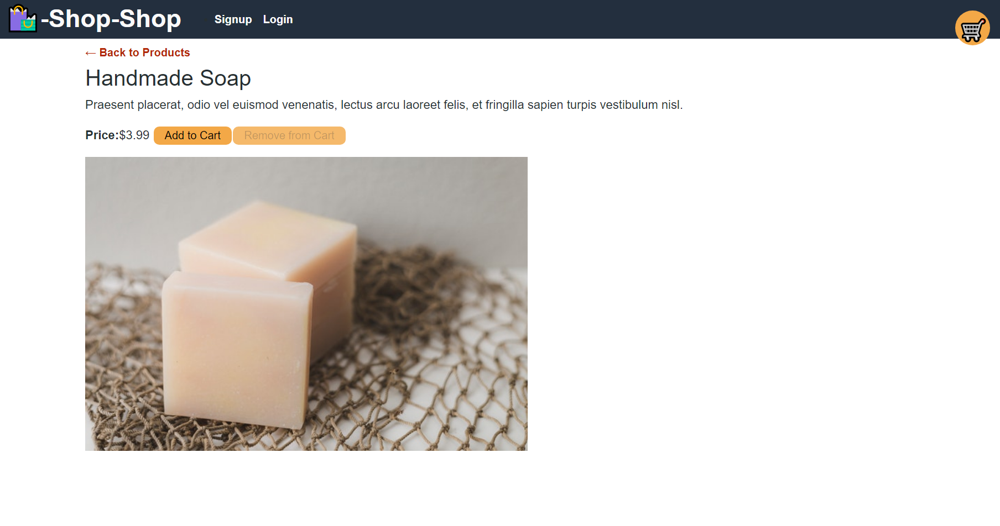
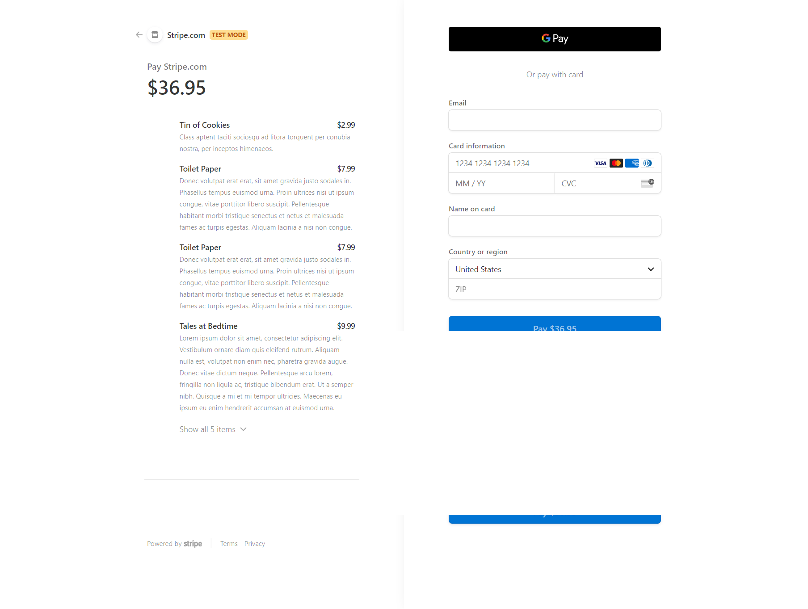

# Shop-Shop Redux Store <!-- omit in toc -->
- [Description](#description)
- [Technologies Used](#technologies-used)
- [User Story](#user-story)
- [Acceptance Criteria](#acceptance-criteria)
## Description
Shop-shop is an e-commerce web application that users can use to search and buy a variety of items. This application uses the Mongo, Express, React, Node tech stack to deliver a performant and intuitive user-experience.

The deployed application can be found [here](https://secret-dusk-57501.herokuapp.com/).

On initial app load, the user is presented with a list of available products.


Users can filter the products by category.


Users can view more information on an item by clicking on the item from the main page.


Users can add items to their cart. The cart opens whenever an item is added to the cart. The cart can be used to change quantity of items in the cart, remove items from the cart, and checkout.


Users can login or signup in order to checkout.


Users are directed to Stripe in order to checkout and complete payment.


## Technologies Used
Languages: HTML, CSS, JavaScript, GraphQL
Frameworks: Mongo, Express, React, Node
Libraries: Mongoose, Redux, Apollo, Stripe
## User Story
```
AS a senior engineer working on an e-commerce platform
I WANT my platform to use Redux to manage global state instead of the Context API
SO THAT my website's state management is taken out of the React ecosystem
```
## Acceptance Criteria
```
GIVEN an e-commerce platform that uses Redux to manage global state
WHEN I review the app’s store
THEN I find that the app uses a Redux store instead of the Context API
WHEN I review the way the React front end accesses the store
THEN I find that the app uses a Redux provider
WHEN I review the way the app determines changes to its global state
THEN I find that the app passes reducers to a Redux store instead of using the Context API
WHEN I review the way the app extracts state data from the store
THEN I find that the app uses Redux instead of the Context API
WHEN I review the way the app dispatches actions
THEN I find that the app uses Redux instead of the Context API
```